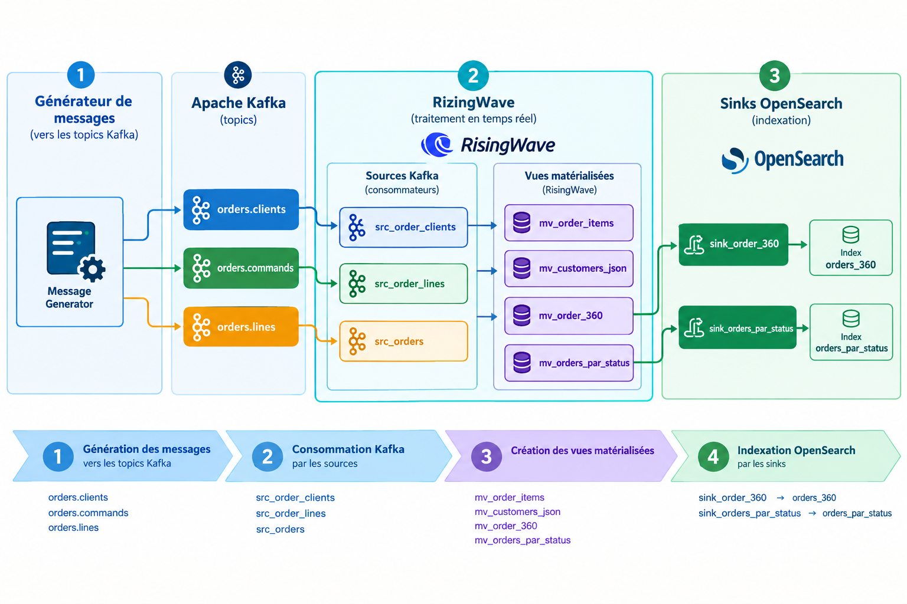

# RisingWave Demo — Exemple `orders` (Redpanda → RisingWave → OpenSearch)

Template de projet démontrant un pipeline temps réel traitant des commandes
(`orders`) : ingestion depuis Redpanda, traitement SQL dans RisingWave,
et export vers OpenSearch.

## Architecture



Chaque concept métier arrive dans un **topic dédié** :

| Topic | Concept |
| --- | --- |
| `orders.clients` | Métadonnées client |
| `orders.lines` | Lignes de commande (une ligne par message) |
| `orders.commands` | Document commande complet (racine)

Les données sont ensuite agrégées par des **materialized views** et envoyées
vers OpenSearch via des **sinks**.

## Démarrage rapide

```bash
# 1. Démarrer la stack, appliquer le SQL et lancer le générateur (tout-en-un)
make init

# 2. Inspecter les index OpenSearch alimentés par les sinks
make gen-es

# 3. Vue agrégée "360°" d'un client (par id_client)
make view-client ID=4

# 4. Ouvrir psql sur RisingWave
make psql
```

> Remarque : `make init` suppose que le générateur tourne pendant quelques
> secondes pour produire des données avant de consulter les index.

## Étapes manuelles (équivalent de `make init`)

```bash
make up          # démarre Redpanda, RisingWave, OpenSearch, MinIO, ...
make init-sql    # applique sql/01..03 (sources, MV, sinks)
make generator   # lance le générateur de données
```

## Scripts SQL

| Fichier | Rôle |
| --- | --- |
| `sql/01_sources.sql` | Création des sources Redpanda pour `orders` |
| `sql/02_materialized_views.sql` | Vues matérialisées (agrégations `orders`) |
| `sql/03_sinks.sql` | Envoi des agrégats vers OpenSearch |

### Matérialisations produites (exemple `orders`)

- `mv_order_items` : agrégation des lignes de commande par `order_id` (JSONB)
- `mv_customers_json` : transformation des enregistrements clients en JSONB
- `mv_order_360` : document commande enrichi (racine + customer + items)
- `mv_orders_par_status` : agrégat simple par `status` (nombre, montant total)

### Index OpenSearch

`orders_360`, `orders_par_status`.

## Interfaces

| Service | URL | Identifiants |
| --- | --- | --- |
| RisingWave Dashboard | http://localhost:5691 | — |
| RisingWave Console | http://localhost:8020 | `root` / `root` |
| Redpanda Console | http://localhost:8082 | — |
| OpenSearch Dashboards | http://localhost:5601 | — |
| OpenSearch (API) | http://localhost:9200 | — (sécurité désactivée) |
| MinIO | http://localhost:9400 | `hummockadmin` / `hummockadmin` |

## Connexions

- **RisingWave (psql)** : `psql -h localhost -p 4566 -U root -d dev`
- **Redpanda (interne)** : `redpanda:29092` — (hôte) `localhost:9092`

## Structure du projet

```
.
├── docker-compose.yaml          # Stack complète
├── Makefile                     # Commandes rapides
├── prometheus.yaml              # Config Prometheus (métriques RisingWave)
├── README.md
├── sql/                         # Scripts SQL RisingWave
│   ├── 01_sources.sql
│   ├── 02_materialized_views.sql
│   └── 03_sinks.sql
└── generator/                   # Générateur de données de démo (Go)
  ├── Dockerfile               # build multi-étage (golang + alpine)
  ├── go.mod / go.sum
  └── main.go                  # production continue (franz-go)
```

## Services Docker

| Service | Rôle |
| --- | --- |
| `redpanda` | Broker Kafka-compatible (topics des événements) |
| `redpanda-init` | Crée les topics `orders.*` (one-shot) |
| `redpanda-console` | Interface web Redpanda (topics, messages) |
| `risingwave-standalone` | Moteur de streaming + agrégations |
| `opensearch` | Stockage des agrégats (sinks) |
| `opensearch-dashboards` | Interface web OpenSearch (exploration/discovery) |
| `orders-generator` | Producteur de données de démo (`generator` container) |
| `risingwave-init` | Applique les scripts SQL (one-shot) |
| `postgres-0` / `minio-0` | Méta-store / state-store de RisingWave |
| `prometheus-0` / `risingwave-console` | Observabilité & UI |

## Nettoyage

```bash
make down    # arrête la stack (conserve les volumes)
make clean   # arrête et supprime les volumes (données reset)
```

## Personnalisation

- **Port des topics Redpanda** : modifiable via `generator` et les scripts SQL
  (`properties.bootstrap.server`).
- **Nombre de messages** : ajuster `MESSAGE_INTERVAL_MS` et le volume produit
  dans `generator/main.go`.
- **Index / mapping OpenSearch** : préconfigurer des index avec dynamic
  templates dans OpenSearch si besoin d'un mapping précis des types.
