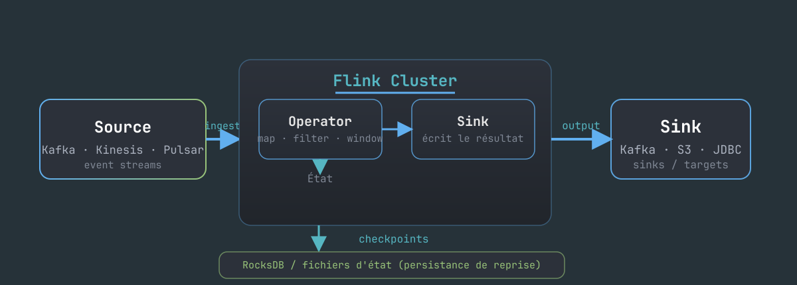

<!-- _class: cover -->

# Apache Flink
### Streaming temps réel & traitement d'événements

La référence du stream processing — **distribué**, **stateful** et **fault-tolerant**. Nous allons explorer son histoire, son approche, et ses limites — avec en particulier le rôle central de RocksDB dans la gestion d'état.

---

<!-- _class: lead -->

## Pourquoi Flink ?

Le streaming est une discipline **hard-core** : il faut absorber des milliards d'événements, garantir un traitement **exactly-once**, maintenir une latence faible, et gérer un état distribué à l'échelle. Chaque contrainte, à elle seule, représenterait déjà un défi de taille.

> Apache Flink a démocratisé le stream processing **à grande échelle** en offrant un moteur unique pour traiter à la fois le **batch** **et** le **stream**.

---

## L'histoire : d'un projet allemand à la référence

Le projet est **né à Berlin**, au sein du laboratoire de recherche *Stratosphere* de la TU Berlin, où il prolonge un système de traitement distribué du même nom pour aboutir à un moteur batch innovant.

- **2011** : une thèse de recherche autour de Stratosphere pose les bases d'un moteur batch distribué doté d'un plan optimiseur **de type SQL**.
- **2014** : le projet est **incubé chez Apache**, où il prend officiellement le nom de **Flink**.
- **2014-2016** : un pivot fondateur s'opère — Flink devient **le** moteur de **streaming nativement continu**, là où Hadoop et Spark se limitaient encore au micro-batch.
- **2019** : Flink passe au rang de **top-level project** Apache, et son adoption explose chez Alibaba, Uber, Netflix, Lyft et bien d'autres.

> La force historique de Flink tient en une idée : traiter le **flux comme un flux**, plutôt que comme une suite de micro-batches.

---

## Le déclaratif : une idée ancienne, adoptée tard par Flink

L'approche **SQL / déclarative** appliquée aux pipelines n'est **pas née avec Flink** : elle est l'héritage de **50 ans de bases relationnelles**, enrichie par plusieurs décennies de recherche sur les **flux** — on parle alors de "continuous queries" ou de "data streams as tables".

| Étape | Quand | Fait marquant |
|---|---|---|
| **SQL / relationnel** | 1970 → | Codd puis System R (IBM) : le **quoi**, déclaratif |
| **Streaming + SQL** | 1990-2000 | CQL, TelegraphCQ : requêtes continues sur flux |
| **Stratosphere** | 2009-2011 | ancêtre de Flink : optimiseur **de type SQL** |
| **Table API** | **Flink 0.9, 2015** | première API déclarative relationnelle (preview) |
| **Flink SQL** | **Flink 1.4, 2017** | le SQL s'applique réellement au streaming |
| **Maturation** | 2019+ | upgrade du fork Blink (Alibaba) : perfs SQL |
| **Materialized Tables** | 2024-2025 | Flink se rapproche du modèle "base de données" |

> Le déclaratif a **démocratisé** le stream processing chez Uber, Netflix et Alibaba — une superbe idée, mais que Flink a surtout **utilisée à côté** du code impératif, sans jamais en faire le modèle unique d'interaction.

---

## L'approche : le vrai streaming, continu

Flink applique le traitement **événement par événement**, de manière continue, là où Spark opte pour le **micro-batch** en découpant le temps en paquets. Cette différence fondamentale est au cœur de l'identité de Flink.

- **Distribué** : un cluster de *TaskManagers* exécute les tâches en parallèle, répartissant la charge sur la machine.
- **Stateful** : les opérateurs conservent leur état en mémoire, complété par un état **externe** (checkpoints) pour pouvoir reprendre proprement après un crash.
- **Fault-tolerant** : les **checkpoints** associés au **barrier alignment** garantissent l'**exactly-once** — état restauré, rejeu contrôlé.
- **Double face** : une API **impérative** (DataStream, DataSet) et une API **déclarative** (Table / Flink SQL) qui se recouvrent partiellement.

---

## Le modèle en un coup d'œil



- **Sources** : consomment les événements (Kafka, Pulsar, Kinesis...).
- **Opérateurs** : map / filter / window / aggregate... qui **portent un état**.
- **Sinks** : écrivent les résultats (Kafka, S3, JDBC...).
- **Checkpoints** : sauvegarde périodique de l'état pour la reprise.

---

## La gestion d'état : le cœur, et son revers

Chaque opérateur stateful doit **persister son état** pour survivre aux pannes et reprendre exactement là où il s'était arrêté. Pour cela, Flink stocke l'état dans un **keyed state** distribué, qu'il sauvegarde régulièrement sous forme de **checkpoints**.

Par défaut — et c'est de loin le cas le plus courant en production — l'état **repose entièrement sur RocksDB**, un composant de stockage local rigide et délicat à faire évoluer :

```java
// Java / Scala — DataStream API (le monde impératif)
DataStream<String> lines = env.addSource(consumer);
lines
  .keyBy(event -> event.getCustomerId())
  .process(new KeyedProcessFunction<Long, Event, Result>() {
      private ValueState<Long> count;          // état par clé
      public void processElement(...) {
          long n = count.value() + 1;
          count.update(n);                      // persisté dans RocksDB
      }
  });
```

---

## Flink SQL : le versant déclaratif

Flink offre également un **SQL déclaratif** (via la Table API / Flink SQL) qui permet de traduire une requête en un **plan de streaming** continu :

```sql
-- Flink SQL : une table de streaming qui se met à jour en continu
CREATE TABLE claims (
  type_sinistre  STRING,
  montant        DECIMAL(10, 2),
  ts             TIMESTAMP(3),
  WATERMARK FOR ts AS ts - INTERVAL '5' SECOND
) WITH ('connector' = 'kafka', 'topic' = 'claims', ...);

CREATE TEMPORARY VIEW mv_par_type AS
SELECT type_sinistre, COUNT(*) AS nb, SUM(montant) AS total
FROM claims GROUP BY type_sinistre;
```

Le SQL est alors **compilé** en un graphe d'opérateurs stateful qui s'exécute comme n'importe quel job — avec watermarks et fenêtres qu'il reste néanmoins à configurer explicitement.

---

## Les limites : la machine est complexe

Flink est **puissant**, mais cette puissance a un **coût opérationnel
et architectural** important.

- **Orienté *jobs*** : on **soumet** un job qui possède son **propre cycle de vie** et son **propre état**, et le résultat produit n'est pas une table directement interrogeable.
- **État interne, non interrogeable** : l'état vit à l'intérieur du cluster Flink, il faut l'exporter pour pouvoir le requêter — aucun `SELECT` direct n'est possible.
- **RocksDB, la bête noire** : le stockage local par défaut impose d'accorder soigneusement la config (mémoire, compression, structure LSM), difficile à dimensionner, à débugger et à faire évoluer (`--allowNonRestoredState`).
- **Gourmand en ressources** : la JVM, RocksDB (memoire, compression, structure LSM), le *backpressure* et le tuning font grimper la consommation CPU/mémoire ; un job "simple" réclame vite plusieurs TaskManagers à dimensionner et surveiller.

---

## La complexité architecturale

Le prix de cette flexibilité se paie en **outillage et en savoir-faire** :

- **Deux API à maîtriser** : le SQL et la DataStream API impérative coexistent, et l'écosystème réel penche d'ailleurs souvent vers le code Java/Scala.
- **Concepts non triviaux** : **watermarks**, **windowing**, **state TTL**, **idleness**, **alignment des barrières** — autant de notions qu'il faut comprendre explicitement pour les configurer correctement.
- **Redéploiement** : modifier un job ou une requête impose un **redeploy**, avec sauvegarde et rechargement de l'état et gestion des changements de schéma.
- **Cluster distribué** : un *JobManager* et des *TaskManagers*, des checkpoints, du resource tuning, et le monitoring des backpressures.

> Flink est un **moteur de traitement** qu'on opère. Tout le modèle — jobs, états, checkpoints, redéploiement — est géré **par vous**.

---

<!-- _class: lead -->

## Faut-il y aller ?

Flink est **adapté** lorsque la complexité est assumée : des équipes data engineering dédiées, un besoin réel de **contrôle fin** (API impérative, Stateful Functions), et des pipelines variés et fortement customisés.

> Mais si vous cherchez le **temps réel sans la complexité**, un modèle de **base de données** déclarative (comme RisingWave) réalise le même travail avec bien moins d'effort d'opération.

---

## En résumé : Flink

| Dimension | Apache Flink |
|---|---|
| **Modèle** | Moteur de traitement distribué (jobs) |
| **Langage** | SQL déclaratif **+** DataStream impératif (Java/Scala) |
| **Unité** | un *job* avec son état et son cycle de vie |
| **État** | interne, persisté sur **RocksDB**, non interrogeable |
| **Garanties** | exactly-once via checkpoints / barrier alignment |
| **Interaction** | SDK / backend, redéploiement pour tout changement |
| **Ressources** | JVM + RocksDB, clusters de TaskManagers à tune |
| **Complexité** | **élevée** : cluster, checkpoints, tuning RocksDB |

---

<!-- _class: lead -->

## À retenir

1. Flink a **réinventé le streaming continu**, distribué et fault-tolerant.
2. En revanche, le résultat d'un job n'est **pas une table** : l'état reste enfermé dans le moteur.
3. L'état **RocksDB** et la gestion des **checkpoints** ajoutent une lourdeur d'**opération** bien réelle.
4. L'ensemble est **puissant mais complexe** — et le streaming "simple" passe précisément par un modèle de **base de données**.

> *Flink a prouvé qu'on pouvait streamer vite et sûrement. La suite, c'est de le rendre **aussi simple qu'une base de données**.*

---

<!-- _class: lead -->

# Merci

### Des questions ?
